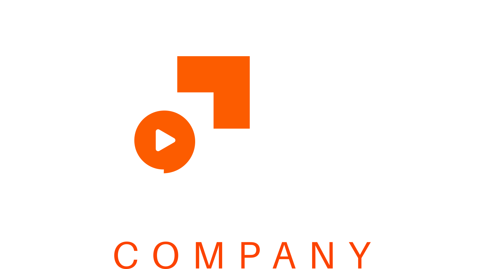

<p align="center">
  
</p>

<p align="center">
  Inspecione, depure e monitore requisições webhook em tempo real.
</p>

<p align="center">
  
  
  
  
  
</p>

---

## Sobre

**WebhookFort** é uma ferramenta de inspeção de webhooks. Crie endpoints únicos e seguros, envie requisições HTTP para eles e inspecione o conteúdo em tempo real — headers, body, query params, IP e muito mais.

## Funcionalidades

- **Endpoints seguros** — cada webhook tem um slug e um token UUID único; a URL só funciona com o par correto
- **Recebe qualquer método HTTP** — GET, POST, PUT, PATCH, DELETE etc.
- **Inspeção completa** — headers, body (com syntax highlight para JSON), query params, IP, user agent e timestamp
- **Leitura em tempo real** — polling automático notifica quando novas requisições chegam
- **Infinite scroll** — lista de requisições carregada progressivamente
- **Lidos / não lidos** — requisições não abertas são destacadas visualmente
- **Reset de token** — gere um novo token a qualquer momento; o token antigo é invalidado imediatamente
- **Exclusão em massa** — apague todas as requisições de um webhook com confirmação
- **URL ocultável** — oculte o link do webhook com blur; preferência salva no localStorage
- **Dashboard** — estatísticas gerais de uso

## Requisitos

- PHP 8.3+
- Node.js 20+
- Composer
- SQLite / MySQL / PostgreSQL

## Instalação

```bash
# Clone o repositório
git clone https://github.com/mayconpaivac/webhooks.git
cd webhooks

# Instale as dependências PHP
composer install

# Instale as dependências JS
npm install

# Configure o ambiente
cp .env.example .env
php artisan key:generate

# Execute as migrations
php artisan migrate

# Compile os assets
npm run build
```

## Desenvolvimento

```bash
# Inicia todos os serviços de desenvolvimento (Laravel + Vite + Queue)
composer run dev
```

Ou separadamente:

```bash
php artisan serve   # servidor Laravel
npm run dev         # Vite (HMR)
```

## Testes

```bash
php artisan test
```

## Como usar

1. Crie um webhook na página **Webhooks** informando um nome
2. Copie a URL gerada (formato `https://seu-dominio/w/{slug}/{token}`)
3. Configure essa URL no serviço que deseja inspecionar
4. As requisições aparecerão em tempo real na lista da esquerda
5. Clique em uma requisição para ver os detalhes completos

> **Atenção:** ao resetar o token, a URL anterior para de funcionar. Atualize o endpoint em todos os serviços que o utilizam.

## Stack

| Camada | Tecnologia |
|--------|-----------|
| Backend | Laravel 13, PHP 8.3 |
| Frontend | Vue 3, Inertia.js v3 |
| Estilização | Tailwind CSS v4 |
| Componentes | Reka UI (shadcn/ui) |
| Testes | Pest v4 |
| Build | Vite |

## Licença

MIT
